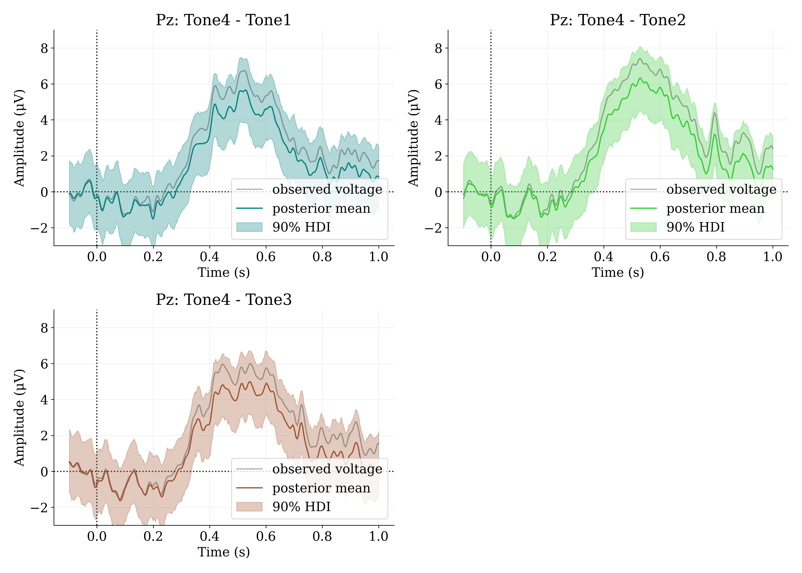
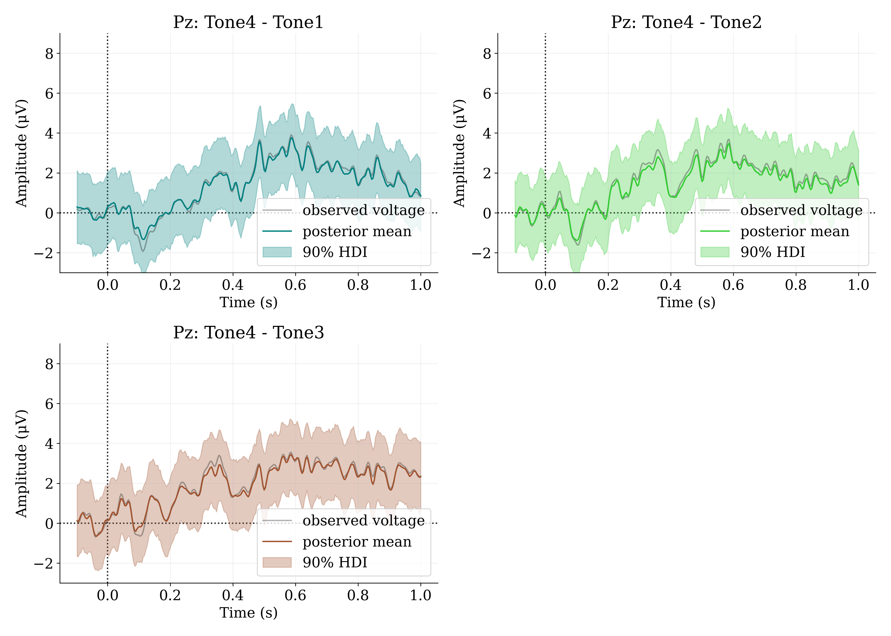
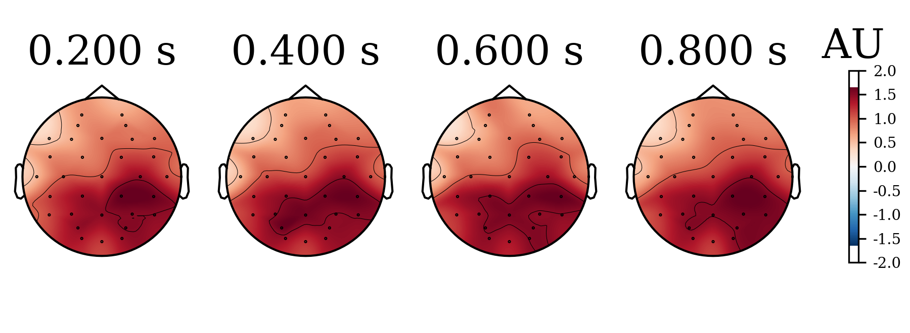
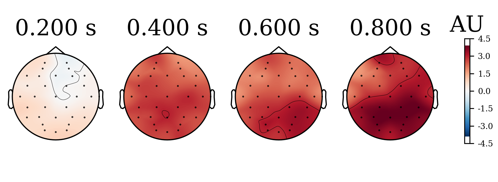

<h1> Bayesian Multivariate Gaussian Random Walk Regression for ERP Estimation </h1>

	The present analysis implements a multivariate Gaussian random walk (MGRW).  

<h1> Model </h1>

 The present model attempts to estimate event-related potentials (ERPs) across the whole epoch. To that aim, we use an MGRW prior to model the voltage changes across time plus a Gaussian noise parameter. Covariance is assumed as a diagonal matrix of ones. A normal distribution (likelihood) is used for the observed voltages with a half-normal distribution as error parameter. 

 &Sigma;1,...&Sigma;C = E &times; E diagonal matrix 

 g1,... gC ~ GRW(0,1), S &times; E 
	 

 <em>x</em>1,... <em>x</em>C = &Sigma;cgcT 

 B = S &times; E &times; C matrix of all <em>x</em> 

 &alpha;s ~ Normal(0, 0.05), S &times; 1 

 &mu; = &alpha;s + BT 

 &sigma; ~ HalfNormal(0.05) + 1 

 y ~ Normal(&mu;, &sigma;) 

 Where C = 4 mandarin tones (tone 1... tone 4), E = EEG electrodes (32), and S = number of samples (282, 100ms baseline, 1s epoch). Data comes from a tone detection oddball task (Tone 4 was the deviant target, 25% of total stimuli), completed by learners and non-learners of Chinese Mandarin. We fit two models, as described above, to data from each learners and non-learners. 

 We sampled the model using Markov chain Monte Carlo (MCMC) No U-turn sampling (NUTS) with 2000 tuning steps, 2000 samples, 4 chains. The model sampled well, with 1.01 > R&#770; > 0.99; BFMIs > 0.9, and bulk ESS > 2000 for all parameters. Ranked trace plots ("trank plots") evidence excellent mixing of chains (see grw_learners/tranks/ and grw_learners/tranks/ folders). 

<h1> Results </h1>

 The estimates from learners indicate that the target tone (tone 4) induced a strong positive voltage deflection after ~200ms respect to the non-target tones at Pz (i.e., tone 4 induced a P3b). Image below shows the contrasts between tone 4 and each other tone from posterior distributions. 

	

 The estimates from non-learners indicate that the target tone (tone 4) induced a milder positive voltage deflection after ~200ms respect to the non-target tones at Pz. Image below shows the contrasts between tone 4 and each other tone from posterior distributions. 

	

 Predictions from the posterior for learners indicate more uncertainty but the P3b is still present. Image below shows contrasts between tone 4 and each other tone from Pz predictions. 

	

 Predictions from the posterior for non-learners also indicate more uncertainty but there is still a mild P3b. Image below shows contrasts between tone 4 and each other tone from Pz predictions. 

	

 Images below show posterior distributions from the learners’ model as scalp topographies (posterior of tone 4 minus all other tones combined). 

<strong>5% highest density intervals (HDI)</strong>

  

<strong>Posterior means</strong>

  

<strong>95% highest density intervals (HDI)</strong>

  

 Images below show posterior distributions from the non-learners model as scalp topographies (posterior of tone 4 minus all other tones combined). 

<strong>5% highest density intervals (HDI)</strong>

  

<strong>Posterior means</strong>

  

<strong>95% highest density intervals (HDI)</strong>

  

<h1> Conclusion </h1>  

 The estimates show that there is a difference of P3b amplitude between learners and non-learners, but some uncertainty. The predictions indicate that the models are efficient. However, the current models lack a proper covariance matrix for electrodes, which is relevant to understand voltage variation across the scalp. Further development of these models is required. 
